# Rent a car Angular Project

This project was generated with [Angular CLI](https://github.com/angular/angular-cli) version 18.2.11.

Project which handles some basic functionality which a normal rent a car website would have.

Home page with list of the available cars for renting, coming from service, which is taking the information from the json-server and testimonials part which currently is read-only.

Contact page got a contact form, that got validations as well.
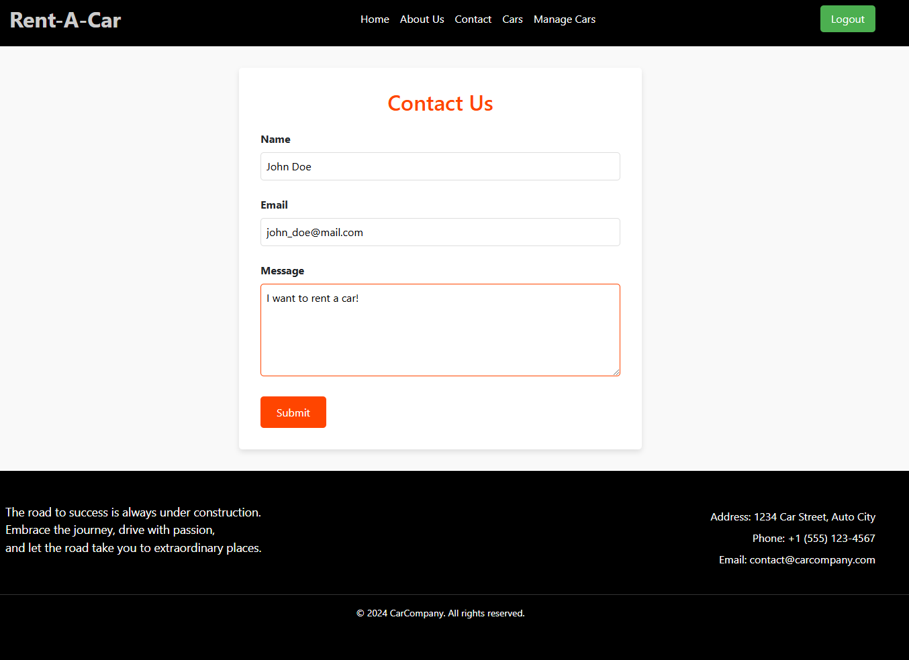

About page with some general information.
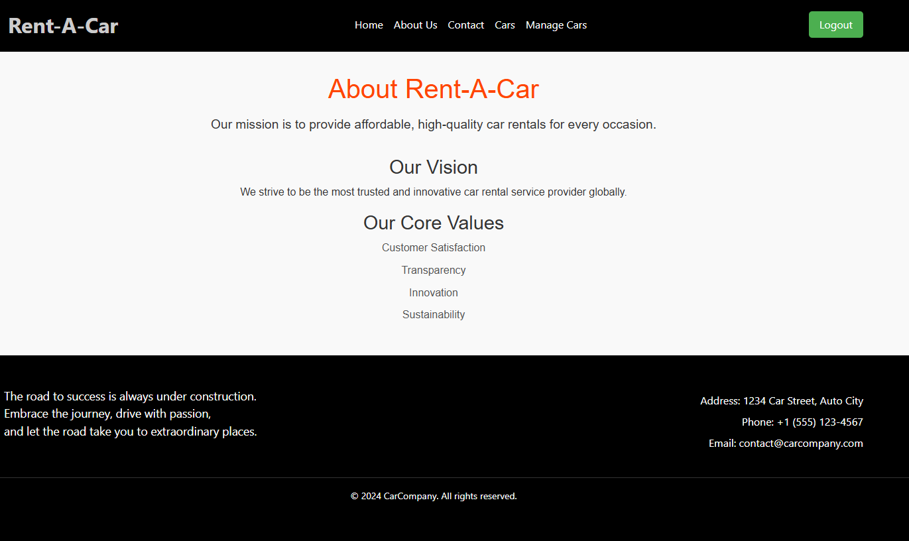

Cars page, which is the "main" one for the application. You are able to see all the available cars and perform searches on parameters like brand, model, mileage, year and fuel type. When you find the suitable vehicle for you, you can click on it to view more details.
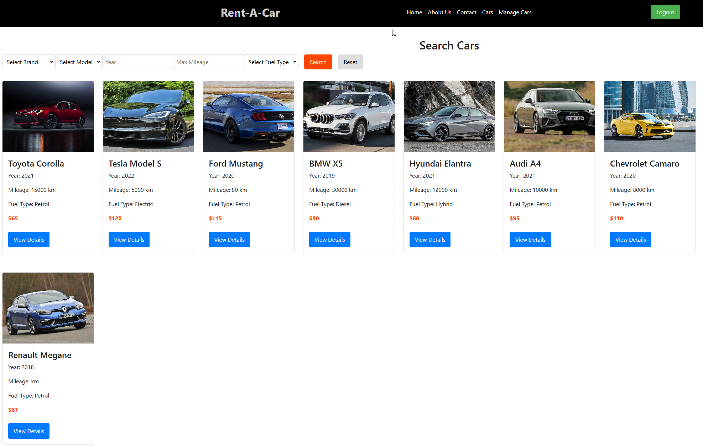

Car  Detail page is a page, where you can see everything for a car, accompanied by a picture. You've got "Rent now" button, which will be clickable, only if you are logged-in user.
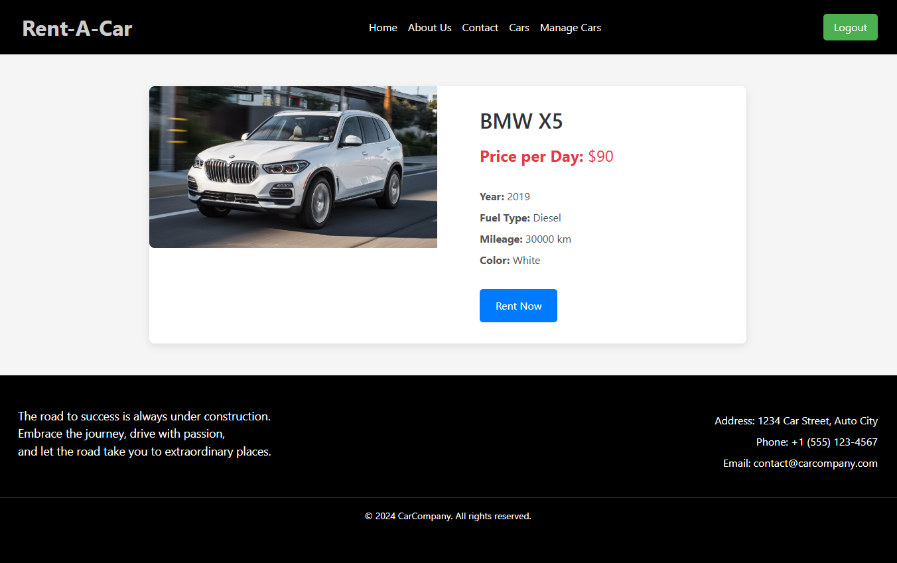

Rent page is the final page for your car rent. In it, you are able to enter the wanted days for rent, again with validations for a starting date, starting from today and end date, later than the start one.
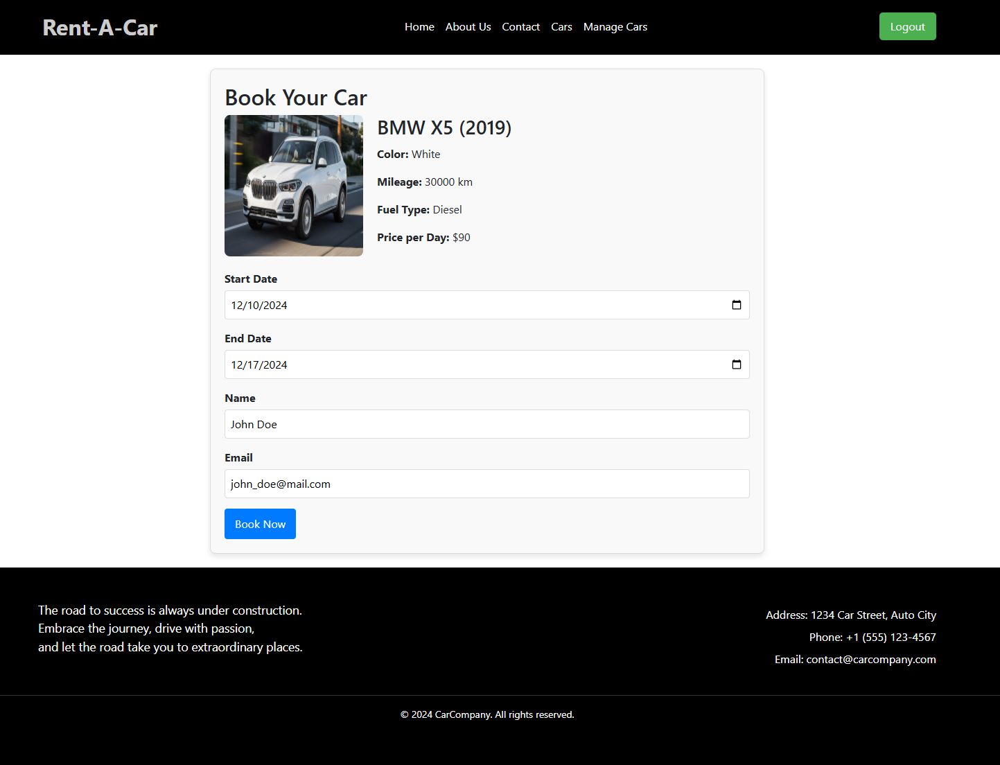

You will receive some fancy notification if successful booking is done. For it, its used sweetalert2 library.
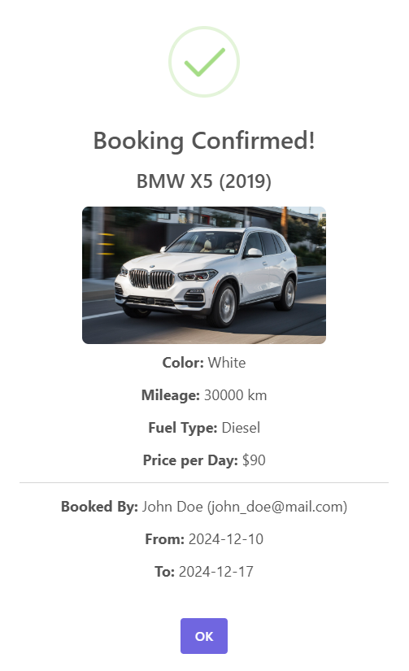

Manage cars page, which is for admin only. It gives the chance to remove, edit, add cars. When editing or adding new, you've got picture preview, which can handle links for images and can handle, mostly used image formats.
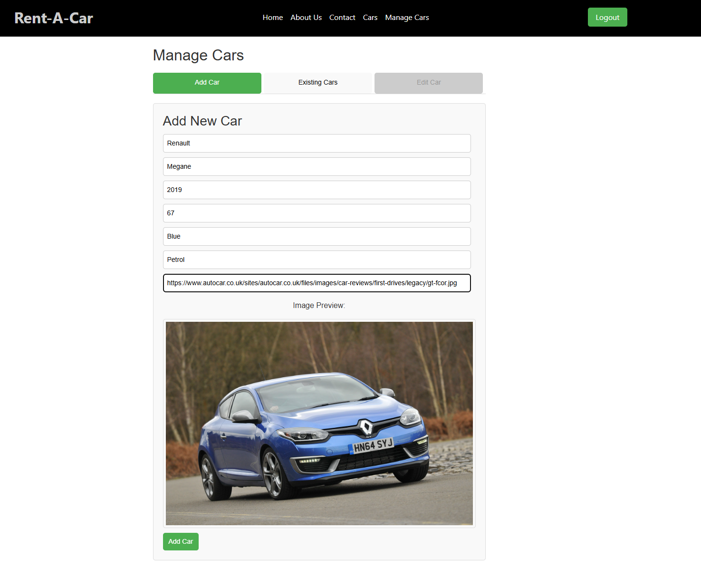

Edit or remove.
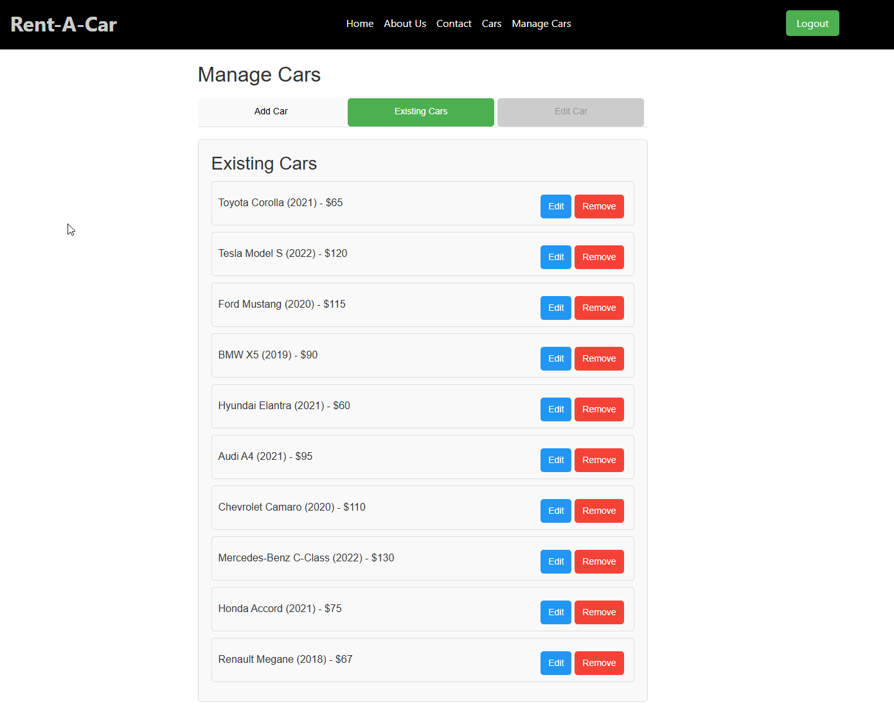

The edit sends you to another part, which you can change each specification of a car.
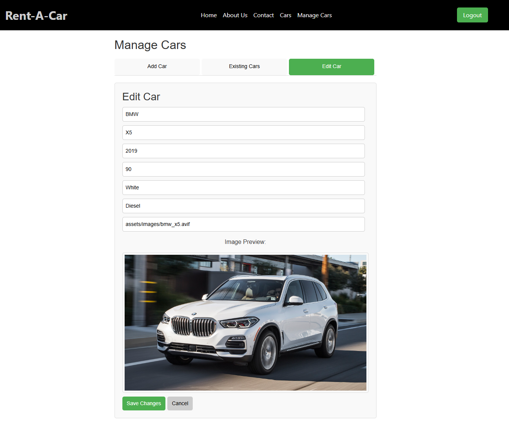

Login page, using JWT token for authentication. Token is deleted after logout or an hour inactivity as well. After successful login, automatically redirects you to the Home page.
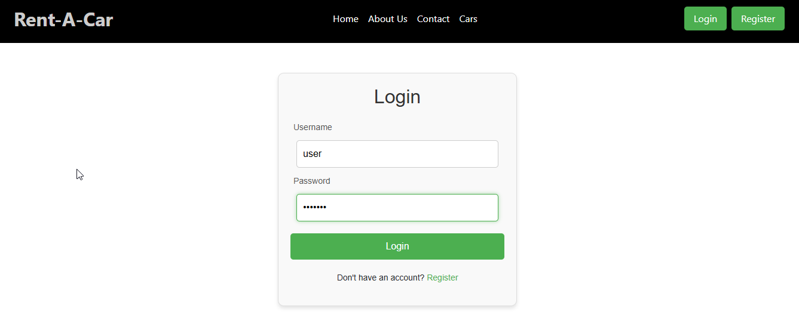

Register page with all the validations for email, password, already in use email and username. Automatic login after successful register.
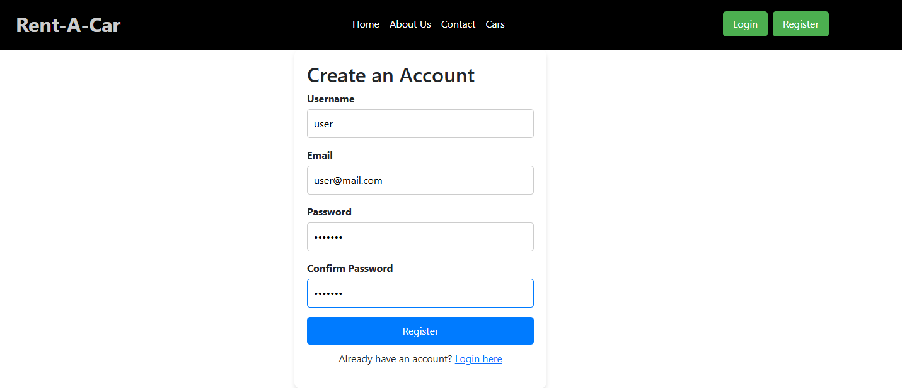

Error page with return to Home button, if you navigate to a non-existing path.
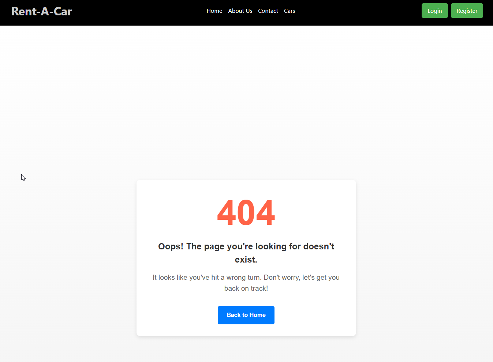

Credentials for admin account:
username: _admin_
password: _admin123_

## Development server

Run `ng serve` for a dev server. Navigate to `http://localhost:4200/`. The application will automatically reload if you change any of the source files.

## Backend server

For a backend, json-server its used, to run it and get all the features for the app, navigate to "assets" folder and run `node server.js`.

## Build

Run `ng build` to build the project. The build artifacts will be stored in the `dist/` directory.

## Further help

To get more help on the Angular CLI use `ng help` or go check out the [Angular CLI Overview and Command Reference](https://angular.dev/tools/cli) page.
